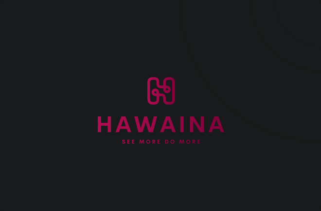

 

 

  <h3>I'm a HAWAINA  🎓<h3/> 
  <h3>from Guru GeekTech courses 🏛. <h3/>
  <h3>I'm a passionate learner who's always willing to learn and work across technologies and domains 💡. <h3/>
  <h3>I love to explore new technologies and leverage them to solve real-life problems ✨. <h3/>
  <h3>Apart from that I also love to guide and mentor newbies👨🏻‍💻. <h3/>
  <h3>I'm deep into Web 🕸️ Development.<h3/>

<h2 align="center">Technology Stack </h2>

<h2 align="center">Reach me out on </h2>

<h2 align="center">
  My Github Stats
</h2>
 
 

  
  

 

 

 

 

If you like it, do fork 🍴 and star ⭐

